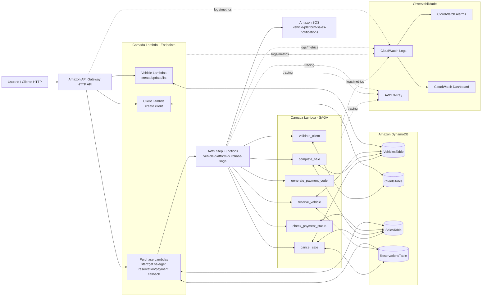
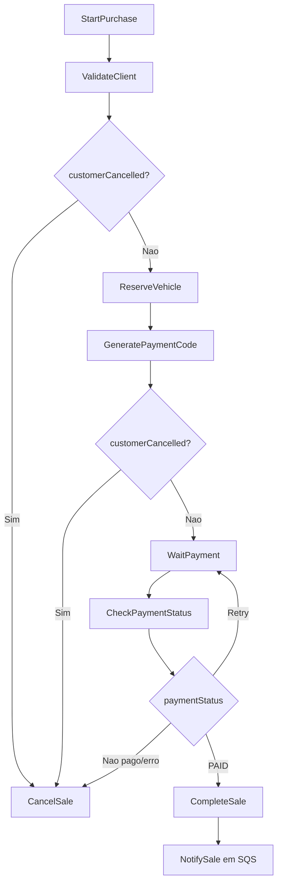

# Desenho da Arquitetura AWS

## Visao geral

```mermaid
flowchart LR
    U[Usuario / Cliente HTTP] --> APIGW[Amazon API Gateway HTTP API]

    subgraph LambdaAPI[Camada Lambda - Endpoints]
      LV[Vehicle Lambdas<br/>create/update/list]
      LC[Client Lambda<br/>create client]
      LP[Purchase Lambdas<br/>start/get sale/get reservation/payment callback]
    end

    APIGW --> LV
    APIGW --> LC
    APIGW --> LP

    LP --> SFN[AWS Step Functions<br/>vehicle-platform-purchase-saga]

    subgraph LambdaSaga[Camada Lambda - SAGA]
      VCL[validate_client]
      RSV[reserve_vehicle]
      GPC[generate_payment_code]
      CPS[check_payment_status]
      CSL[complete_sale]
      CAN[cancel_sale]
    end

    SFN --> VCL
    SFN --> RSV
    SFN --> GPC
    SFN --> CPS
    SFN --> CSL
    SFN --> CAN

    subgraph DynamoDB[Amazon DynamoDB]
      TV[(VehiclesTable)]
      TC[(ClientsTable)]
      TS[(SalesTable)]
      TR[(ReservationsTable)]
    end

    LV <--> TV
    LC <--> TC
    LP <--> TS
    LP <--> TR
    VCL <--> TC
    RSV <--> TV
    RSV <--> TR
    CPS <--> TS
    CSL <--> TS
    CSL <--> TV
    CAN <--> TS
    CAN <--> TV
    CAN <--> TR

    SFN --> SQS[Amazon SQS<br/>vehicle-platform-sales-notifications]

    subgraph Observability[Observabilidade]
      CWL[CloudWatch Logs]
      CWA[CloudWatch Alarms]
      CWD[CloudWatch Dashboard]
      XR[AWS X-Ray]
    end

    APIGW -. logs/metrics .-> CWL
    SFN -. logs/metrics .-> CWL
    LambdaAPI -. logs/metrics .-> CWL
    LambdaSaga -. logs/metrics .-> CWL
    CWL --> CWA
    CWL --> CWD
    LambdaAPI -. tracing .-> XR
    LambdaSaga -. tracing .-> XR
    SFN -. tracing .-> XR
```

## Fluxo SAGA (compra)

```mermaid
flowchart TD
    A[StartPurchase] --> B[ValidateClient]
    B --> C{customerCancelled?}
    C -- Sim --> Z[CancelSale]
    C -- Nao --> D[ReserveVehicle]
    D --> E[GeneratePaymentCode]
    E --> F{customerCancelled?}
    F -- Sim --> Z
    F -- Nao --> G[WaitPayment]
    G --> H[CheckPaymentStatus]
    H --> I{paymentStatus}
    I -- PAID --> J[CompleteSale]
    J --> K[NotifySale em SQS]
    I -- Retry --> G
    I -- Nao pago/erro --> Z
```
